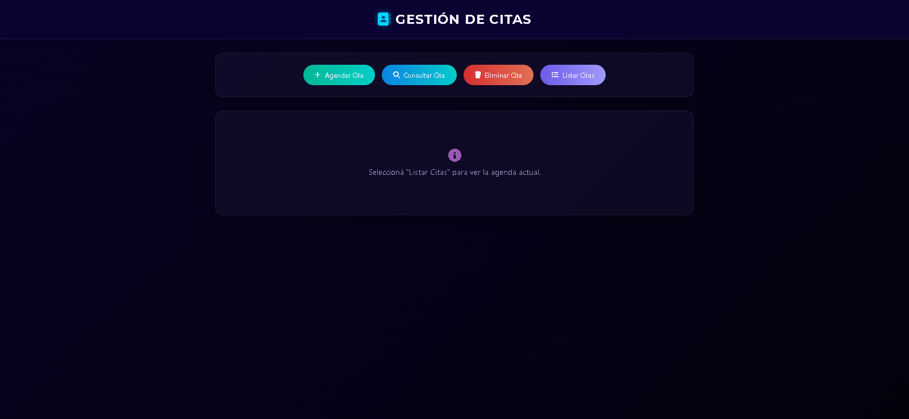
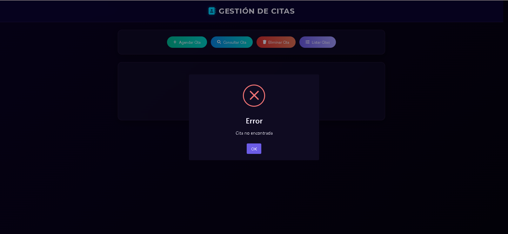
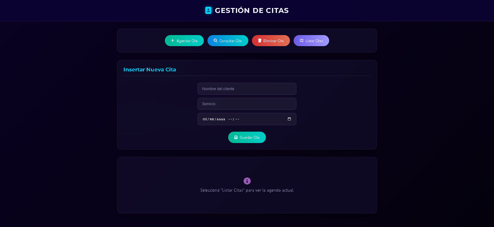
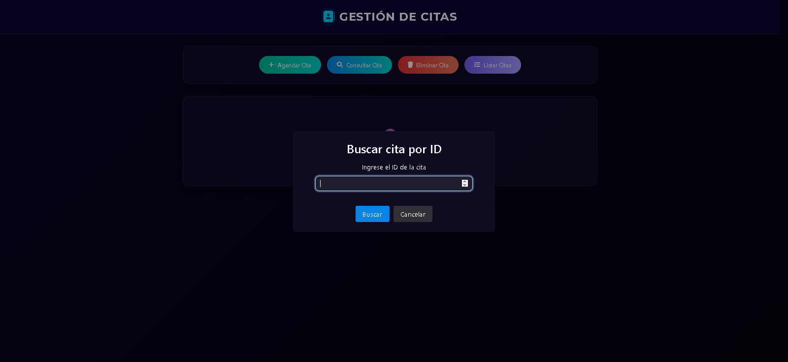
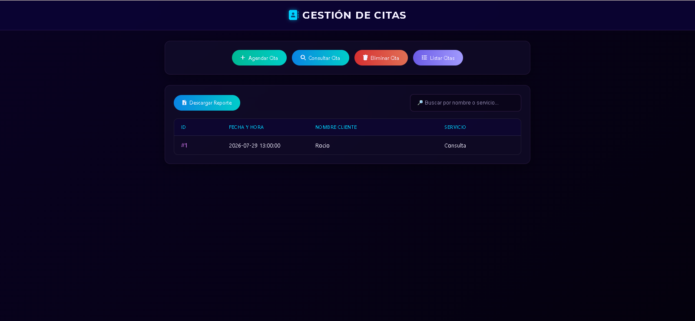

**AppointmentFlow:** Sistema Fullstack de Gestión de Citas

Descripción: AppointmentFlow es una aplicación web diseñada para la gestión eficiente de turnos y citas.
El proyecto se centra en la implementación de Reglas de Negocio reales, asegurando que la agenda sea coherente y funcional.

**Tecnologías utilizadas:**

Backend: Java 17, Spring Boot 3.

Persistencia: Spring Data JPA & MySQL.

Frontend: HTML5, CSS3 (Google Fonts), JavaScript (jQuery).

UI/UX: SweetAlert2 para notificaciones dinámicas.

**Funcionalidades Principales:**

Creación, consulta, listado y eliminación de citas.

**Validaciones de Negocio:**

No permite agendar citas en fechas pasadas.

Control de horario comercial (09:00 a 20:00).

Anti-solapamiento: Verifica que no existan dos citas en el mismo rango horario.

Buscador en Tiempo Real: Filtrado dinámico de la tabla por nombre o servicio.

Reportes: Exportación de la lista de citas a formato Excel directamente desde el navegador.

**Configuración del Proyecto:**
1. Base de Datos:
Crear una base de datos en MySQL llamada db_appointmentflow.

Configurar tu usuario y contraseña de MySQL en el archivo src/main/resources/application.properties.

2. Ejecución:
Ejecutar la aplicación desde tu IDE.

Acceder a la interfaz web en: http://localhost:8080/index.html.

**Estructura del Código**

entity/: Definición de la tabla Cita en la base de datos.

dto/: Objetos de transferencia de datos para desacoplar la API de la base de datos.

mapper/: Lógica para convertir entre Entidades y DTOs.

repository/: Interfaces de Spring Data JPA para el acceso a datos.

service/: Lógica de negocio (validaciones de horarios y fechas).

controller/: Endpoints de la API REST que gestionan las peticiones HTTP.

static/: Frontend desarrollado con HTML, CSS y JavaScript (jQuery).

**Capturas del Proyecto**

Vista principal

Error cita no encontrada

Agendar cita

Consulta cita

Cita encontrada

